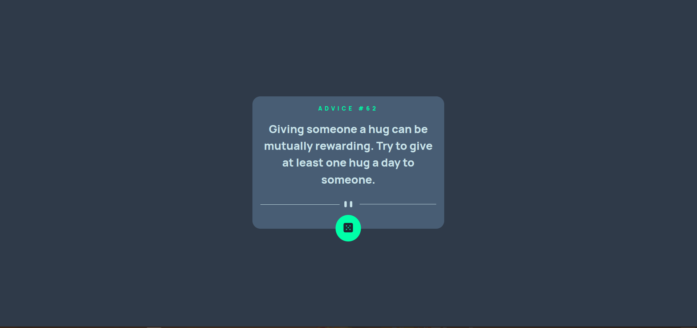

# Frontend Mentor - Advice generator app solution

This is a solution to the [Advice generator app challenge on Frontend Mentor](https://www.frontendmentor.io/challenges/advice-generator-app-QdUG-13db). Frontend Mentor challenges help you improve your coding skills by building realistic projects.

## Table of contents

- [Overview](#overview)
  - [The challenge](#the-challenge)
  - [Screenshot](#screenshot)
  - [Links](#links)
- [My process](#my-process)
  - [Built with](#built-with)
  
  
  - [Useful resources](#useful-resources)
- [Author](#author)

## Overview

### The challenge

Users should be able to:

- View the optimal layout for the app depending on their device's screen size
- See hover states for all interactive elements on the page
- Generate a new piece of advice by clicking the dice icon

### Screenshot

### Links

- Solution URL: [github](https://github.com/joseph-birara/advice-generator-with-ReactJs-frontend-mentor-challenge)
- Live Site URL: [netlify](https://random-advice-generator-reactjs.netlify.app/)

## My process

### Built with

- Semantic HTML5 markup
- CSS custom properties
- Flexbox
- CSS Grid
- Mobile-first workflow
- [React](https://reactjs.org/) - JS library
- [axios](https://axios-http.com/) - to fetch API 
- [CSS](https://styled-components.com/) - For styles

### Useful resources

- [axios documentation](https://axios-http.com/docs/intro) - This helped me to understand how axios worls and to integrate with reactjs. I really liked this pattern and will use it going forward.

## Author

- github - [joseph-birara](https://github.com/joseph-birara)
- Frontend Mentor - [@joseph](https://www.frontendmentor.io/profile/joseph)
- Linkedin - [@joseph-birara](https://www.linkedin.com/in/joseph-birara)

